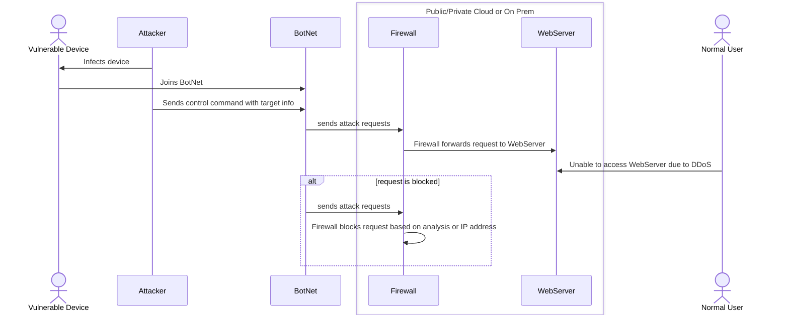

## Explanation of Sequence Diagram

<b>Participants</b>
- Vulnerable Device: This could be any device, such as an IoT device or a person's computer, that gets infected with malware designed to turn it into a bot for a botnet
- Attacker: The threat actor that is using a BotNet (via control commands) to start a DDoS attack.
- Firewall: A piece of software that sits between a webserver and incoming requests and filters requests based on rules. Firewalls can be configured to block specific IP addresses and IP address ranges or they can be configured to block requests based on other rulesets. Advanced firewalls employ machine learning algorithms that inspect the requests and block them based on the analysis of the algorithm. 
- WebServer: A piece of software that accepts web requests (typically HTTP or HTTPS) and normally returns responses. A DDoS attack could overload the webserver itself by causing it to run out of available cpu resources trying to handle the requests or the attack could overload the network infrastructure the webserver relies on.
- Normal User: Any person that is trying to access the webserver normally and may be unable to successfully interact with the webserver due to the DDoS attack

<b>Steps of a DDoS attack</b>
1. First, enough vulnerable devices must be added to the BotNet in order to perform an effective DDoS attack 
2. Once a BotNet is of sufficient size, the attacker initiates a DDoS attack by sending a control command with the IP address (or hostname) of the desired target
3. All the bots in the BotNet that receive the control command start sending requests at a fast rate to the target (the webserver in this case)
4. At first, the firewall might not recognize that this is a DDoS attack and forward requests to the webserver. If enough traffic makes it through, it might overload the webserver
5. If the server is overloaded, normal users will not be able to make requests to it
6. Alternatively, if the firewall detects that a request is from a DDoS attack, the firewall will block it from going through

## Sources
- https://www.cloudflare.com/learning/ddos/what-is-a-ddos-attack/
- https://blog.cloudflare.com/waf-ml/
- https://www.mdpi.com/1424-8220/23/4/2073

